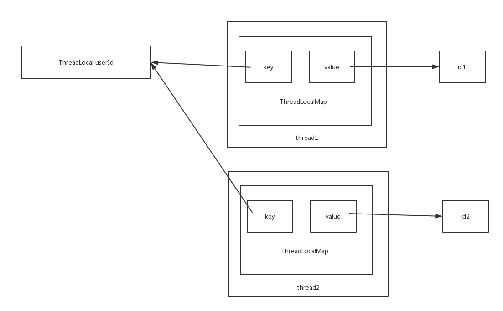
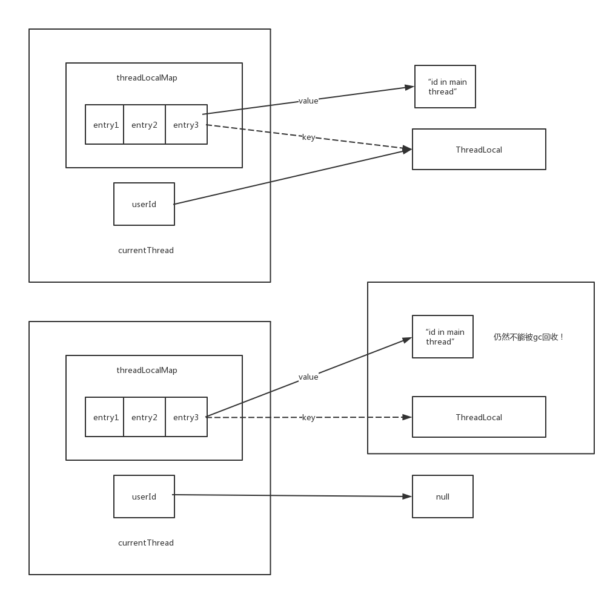

# 【面向知识点学习】ThreadLocal

### 知识点1：ThreadLocal是什么？

1. 需要理解线程安全，简单来说造成线程不安全的原因有两个。
   + `不想共享的变量被共享了`
   + `想共享的没及时共享`

ThreadLocal解决的是第一个问题。

1. 权威解释
```
// 第一段
 * This class provides thread-local variables.  These variables differ from
 * their normal counterparts in that each thread that accesses one (via its
 * {@code get} or {@code set} method) has its own, independently initialized
 * copy of the variable.  {@code ThreadLocal} instances are typically private
 * static fields in classes that wish to associate state with a thread (e.g.,
 * a user ID or Transaction ID).
// 第二段
 * <p>Each thread holds an implicit reference to its copy of a thread-local
 * variable as long as the thread is alive and the {@code ThreadLocal}
 * instance is accessible; after a thread goes away, all of its copies of
 * thread-local instances are subject to garbage collection (unless other
 * references to these copies exist).
```
不翻译了，记几点需要注意的

+ ThreadLocal对象通常是private static fields
+ 线程运行结束后可以对该线程的变量副本进行回收，除非该副本有别的引用
+ 一些关键字：副本，线程独享

一个例子，运行两个线程分别设置userId的值，可以看到互不干扰。

```
public class Test {

    private static ThreadLocal<String> userId = ThreadLocal.withInitial(() -> "init_id");

    public static void main(String[] args) throws InterruptedException {
        Thread thread1 = new Thread(() -> {
            try {
                TimeUnit.SECONDS.sleep(2);
                System.out.println("initial userId in thread1:" + userId.get());
                userId.set("id1");
                System.out.println("thread1 set userId id1");
            } catch (InterruptedException e) {
                e.printStackTrace();
            }
        });

        Thread thread2 = new Thread(() -> {
            try {
                System.out.println("initial userId in thread2:" + userId.get());
                TimeUnit.SECONDS.sleep(1);
                userId.set("id2");
                System.out.println("thread2 set userId id2");
                TimeUnit.SECONDS.sleep(2);
                System.out.println("now userId in thread2:" + userId.get());

            } catch (InterruptedException e) {
                e.printStackTrace();
            }
        });

        thread1.start();
        thread2.start();

        thread1.join();
        thread2.join();

    }
}
```

```
initial userId in thread2:init_id
thread2 set userId id2
initial userId in thread1:init_id
thread1 set userId id1
now userId in thread2:id2
```
### 知识点二：ThreadLocal实现原理

最关键代码如下，在任何代码中执行Thread.currentThread()，都可以获取到当前执行这段代码的Thread对象。既然获得了当前的Thread对象了，如果让我们自己实现线程独享变量怎么实现呢？自然是在当前Thread对象中使用一个集合来存储这些变量，这样每个线程都持有一个本地变量集合互相不干扰。

```java
public static native Thread currentThread();
```


打开Thread类一看，确实有一个集合ThreadLocalMap。ThreadLocalMap是一个类似HashMap的存储结构，那么它的key和value分别是什么呢？

```
public
class Thread implements Runnable {
...
    /* ThreadLocal values pertaining to this thread. This map is maintained
     * by the ThreadLocal class. */
    ThreadLocal.ThreadLocalMap threadLocals = null;
...
}
```


如下，key是一个ThreadLocal对象，value是我们要存储的变量副本

```
        static class Entry extends WeakReference<ThreadLocal<?>> {
            /** The value associated with this ThreadLocal. */
            Object value;

            Entry(ThreadLocal<?> k, Object v) {
                super(k);
                value = v;
            }
        }
```


至此，一切都明了了。调用链如下：


例子中的存储结构简图如下：



> 总结：ThreadLocal对象通过Thread.currentThread()方法获得当前Thread对象，并且获得当前Thread对象中的本地变量副本存储集合ThreadLocalMap对象。ThreadLocal对象用自己作为key来操作ThreadLocalMap对象中的value，而这个value就是线程独享的变量副本。关键代码在ThreadLocal类中：


```java
    public void set(T value) {
    	// 获取当前线程的Thread对象
        Thread t = Thread.currentThread();
        // 获取当前线程的ThreadLocalMap对象
        ThreadLocalMap map = getMap(t);
        // 如果map不为空，直接设置值
        if (map != null)
            map.set(this, value);
        else
            // 如果为空，先创建map再设置值
            createMap(t, value);
    }
    
    
    public T get() {
        Thread t = Thread.currentThread();
        ThreadLocalMap map = getMap(t);
        // 如果不为空返回map中的value
        if (map != null) {
            ThreadLocalMap.Entry e = map.getEntry(this);
            if (e != null) {
                @SuppressWarnings("unchecked")
                T result = (T)e.value;
                return result;
            }
        }
        // 否则返回初始值
        return setInitialValue();
    }
```


### 知识点三：ThreadLocal的内存泄露问题

#### ThreadLocal为什么会有内存泄露问题?

`因为对ThreadLocal理解不足而造成的使用不当`

ThreadLocal本质上只是对当前Thread对象中ThreadLocalMap对象操作的一层封装。如果jdk放开权限让我们自己操作这个map，什么情况下会内存泄露呢？线程活的比较长，而我们没有把map中的Entry及时remove，就会造成内存泄露。

一个例子

```java
public class Test3 {
    public static void main(String[] args) throws NoSuchFieldException, IllegalAccessException {

        Object[] entrys = getEntrys();

        System.out.println("初始化threadLocalMap的entrys数量为：" + getSize(entrys));
        
        ThreadLocal<String> userId = ThreadLocal.withInitial(() -> "init id");
        userId.set("id in main thread");
        
        System.out.println("设置userId后threadLocalMap的entrys数量为：" + getSize(entrys));
        
        // 失去Threadlocal对象的强引用，并且尝试调用gc回收
        userId = null;
        System.gc();
        
        System.out.println("userId置null后threadLocalMap的entrys数量为：" + getSize(entrys));

    }
	// 获得数组中非null元素个数
    private static int getSize(Object[] objects) {
        int count = 0;
        for (Object object : objects) {
            if (object != null) {
                count++;
            }
        }
        return count;
    }

    // 通过反射获得ThreadLocalMap中的底层数组
    private static Object[] getEntrys() throws NoSuchFieldException, IllegalAccessException {
        Thread mainThread = Thread.currentThread();
        Field threadLocals = Thread.class.getDeclaredField("threadLocals");
        threadLocals.setAccessible(true);
        Object threadLocalMap = threadLocals.get(mainThread);
        Class<?>[] declaredClasses = ThreadLocal.class.getDeclaredClasses();
        Field table = declaredClasses[0].getDeclaredField("table");
        table.setAccessible(true);
        return (Object[]) table.get(threadLocalMap);
    }

}
```

```
// 执行结果
初始化threadLocalMap的entrys数量为：2
设置userId后threadLocalMap的entrys数量为：3
userId置null后threadLocalMap的entrys数量为：3
```

从上述结果可以看出，当ThreadLocal对象失去引用之后，ThreadLocalMap中相应的entry并未删除。从而产生内存泄露。如下图：



`网上一些说因为弱引用造成内存泄露的说法是错误的`

如上图所示，虚线代表弱引用，当没有强引用指向ThreadLocal对象时也会被回收，value回收不了。但是问题的根源不是弱引用，而是没有把entry从map中移除。不仅仅是ThreadLocal，`这是使用任何集合都需要注意的问题`。

ThreadLocalMap 中key的弱引用代码如下，弱引用至少可以在你忘了移除ThreadLocalMap对应entry的时候帮你删除entry中的key，可以说这个弱引用有益无害。

```
        static class Entry extends WeakReference<ThreadLocal<?>> {
            /** The value associated with this ThreadLocal. */
            Object value;

            Entry(ThreadLocal<?> k, Object v) {
            // key也就是ThreadLocal对象在ThreadLocalMap的Entry中是一个弱引用
                super(k);
                value = v;
            }
        }
```


#### 怎么防范内存泄露

很简单，使用完毕之后，调用ThreadLocal对象的remove()方法，实际上也是对ThreadLocalMap删除entry的一层包装。

```java
     public void remove() {
         ThreadLocalMap m = getMap(Thread.currentThread());
         if (m != null)
             m.remove(this);
     }
```

### 知识点四：线程池与ThreadLocal

线程池既然是线程独享的，那么当使用线程池的时候，是怎么操作的呢？

很简单，每次使用完毕后remove.

下面是spring web MVC实现RequestContextHolder线程隔离的关键代码。

```java
	// org.springframework.web.context.request.RequestContextHolder
	/**
	 * Reset the RequestAttributes for the current thread.
	 * 重置当前线程的request属性，就是调用ThreadLocal对象的remove()方法
	 */
	public static void resetRequestAttributes() {
		requestAttributesHolder.remove();
		inheritableRequestAttributesHolder.remove();
	}
```


```java
// requestAttributesHolder实际上就是ThreadLocal一个对象
private static final ThreadLocal<RequestAttributes> requestAttributesHolder =
    new NamedThreadLocal<>("Request attributes");
```


```java
	// org.springframework.web.context.request.RequestContextListener
	// 重写ServletRequestListener的方法，request初始化之后调用
	@Override	
	public void requestInitialized(ServletRequestEvent requestEvent) {
		if (!(requestEvent.getServletRequest() instanceof HttpServletRequest)) {
			throw new IllegalArgumentException(
					"Request is not an HttpServletRequest: " + requestEvent.getServletRequest());
		}
		HttpServletRequest request = (HttpServletRequest) requestEvent.getServletRequest();
		ServletRequestAttributes attributes = new ServletRequestAttributes(request);
		request.setAttribute(REQUEST_ATTRIBUTES_ATTRIBUTE, attributes);
		LocaleContextHolder.setLocale(request.getLocale());
        // request来了设置属性到当前线程的ThreadLocal
		RequestContextHolder.setRequestAttributes(attributes);
	}

	// 重写ServletRequestListener的方法，request销毁后调用
	@Override
	public void requestDestroyed(ServletRequestEvent requestEvent) {
		ServletRequestAttributes attributes = null;
		Object reqAttr = requestEvent.getServletRequest().getAttribute(REQUEST_ATTRIBUTES_ATTRIBUTE);
		if (reqAttr instanceof ServletRequestAttributes) {
			attributes = (ServletRequestAttributes) reqAttr;
		}
		RequestAttributes threadAttributes = RequestContextHolder.getRequestAttributes();
		if (threadAttributes != null) {
			// We're assumably within the original request thread...
			LocaleContextHolder.resetLocaleContext();
            // request结束后删除当前线程的ThreadLocal
			RequestContextHolder.resetRequestAttributes();
			if (attributes == null && threadAttributes instanceof ServletRequestAttributes) {
				attributes = (ServletRequestAttributes) threadAttributes;
			}
		}
		if (attributes != null) {
			attributes.requestCompleted();
		}
	}
```


### 知识点五：InheritableThreadLocal

可以被子线程继承的ThreadLocal

```java
public class Test5 extends Thread{

    static ThreadLocal<String> userId = new InheritableThreadLocal<>();

    public static void main(String[] args) throws InterruptedException {
        userId.set("id in main thread");
        Thread thread2 = new Thread(() -> {
            System.out.println(userId.get());
        });
        Thread thread1 = new Thread(() -> {
            System.out.println(userId.get());
            thread2.start();
            try {
                thread2.join();
            } catch (InterruptedException e) {
                e.printStackTrace();
            }
        });
        thread1.start();
        thread1.join();
    }

}
```


```
// 不仅是可以继承的，而且可以被孙子继承，可以一直传下去，传家宝。
id in main thread
id in main thread
```

实现是耦合在Thread类中的，当子线程初始化的时候，将父线程的inheritableThreadLocals设置到子线程中。比较简单，就不展开了。

```
// java.lang.Thread
	/*
     * InheritableThreadLocal values pertaining to this thread. This map is
     * maintained by the InheritableThreadLocal class.
     */
    ThreadLocal.ThreadLocalMap inheritableThreadLocals = null;
```


```
       // java.lang.Thread
       if (inheritThreadLocals && parent.inheritableThreadLocals != null)
            this.inheritableThreadLocals =
                ThreadLocal.createInheritedMap(parent.inheritableThreadLocals);
```

这里有一个坑

`ThreadLocal<String> userId = InheritableThreadLocal.withInitial(()->"init id");`

InheritableThreadLocal并没有重写withInitial方法，这样创建的ThreadLocal实质上不是一个InheritableThreadLocal对象，而是一个SuppliedThreadLocal对象。

```
    public static <S> ThreadLocal<S> withInitial(Supplier<? extends S> supplier) {
        return new SuppliedThreadLocal<>(supplier);
    }
```


```
    static final class SuppliedThreadLocal<T> extends ThreadLocal<T> {

        private final Supplier<? extends T> supplier;

        SuppliedThreadLocal(Supplier<? extends T> supplier) {
            this.supplier = Objects.requireNonNull(supplier);
        }

        @Override
        protected T initialValue() {
            return supplier.get();
        }
    }
```


在Spring中，大部分应用到ThreadLocal的地方都提供了InheritableThreadLocal的实现，可以通过配置启用。但是在我看来应用场景真的不多。无非就是下面的例子：

```
        new Thread(()->{
            HttpServletRequest req = ((ServletRequestAttributes) RequestContextHolder.getRequestAttributes()).getRequest();
        }).start();
```

但是真正使用的时候我们会这样手动创建一个线程吗？一般都用线程池吧。如下：

```
        pool.execute(()->{
            HttpServletRequest req = ((ServletRequestAttributes) RequestContextHolder.getRequestAttributes()).getRequest();
        });
```

线程池中的线程和当前线程非亲非故，怎么继承你的InheritableThreadLocal啊。。。

当项目中用到自定义线程池的时候，需要**非常注意**这些ThreadLocal对象的使用。因为在线程池中你是得不到ThreadLocal的值的。一个典型的例子是Hystrix的线程隔离，你必须清楚的知道，在Hystrix的线程池中是获取不到request线程的ThreadLocal的，否则坑就这么悄然而至。